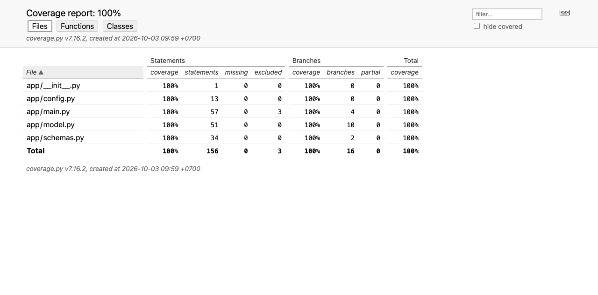

# Lab 3: Testing & CI/CD for ML Systems

[](https://github.com/maxnguyen83/ddm501-lab3-testing-cicd/actions/workflows/ci.yml)
[](https://github.com/maxnguyen83/ddm501-lab3-testing-cicd/actions/workflows/model-validation.yml)
[](https://github.com/maxnguyen83/ddm501-lab3-testing-cicd/actions/workflows/cd.yml)

Testing and CI/CD for a movie rating prediction API (FastAPI + Surprise SVD,
MovieLens 100K). DDM501 - AI in Production, Lab 3.

**What is in this repository**

| Deliverable | Where |
|---|---|
| Unit tests (model wrapper, schemas, config/singleton) | `tests/unit/` (80 tests) |
| Integration tests (API, error handling, bounds) | `tests/integration/test_api.py` (53 tests) |
| Data quality tests (sample + real MovieLens contract) | `tests/data/test_data_quality.py` (49 tests) |
| Model behavioural tests (invariance, directional, MFT) | `tests/model/test_model_behavior.py` (31 tests) |
| Coverage gate (>= 80%, currently 100% lines and branches) | `pyproject.toml`, `ci.yml` |
| CI, CD and model validation workflows | `.github/workflows/` |
| Pre-commit hooks and tool configuration | `.pre-commit-config.yaml`, `pyproject.toml`, `.flake8` |
| Testing strategy, thresholds and bug findings | [`docs/TESTING_STRATEGY.md`](docs/TESTING_STRATEGY.md) |

## Project Structure

```
.
├── app/
│   ├── main.py             # FastAPI app (lifespan loads the model)
│   ├── model.py            # Model wrapper: load, validate IDs, predict, clip
│   ├── schemas.py          # Pydantic request/response schemas and input bounds
│   └── config.py           # Settings from environment variables
├── scripts/
│   ├── train_model.py      # Train SVD, write models/svd_model.pkl + metrics.json
│   └── validate_model.py   # CV threshold gate used by CI/CD
├── tests/
│   ├── conftest.py         # Shared fixtures (TestClient with lifespan, model, samples)
│   ├── unit/               # test_model.py, test_schemas.py, test_utils.py
│   ├── integration/        # test_api.py
│   ├── data/               # test_data_quality.py
│   └── model/              # test_model_behavior.py
├── docs/TESTING_STRATEGY.md
├── .github/workflows/      # ci.yml, cd.yml, model-validation.yml
├── .pre-commit-config.yaml
├── .flake8
├── pyproject.toml          # black, isort, mypy, pytest, coverage settings
├── requirements.txt / requirements-dev.txt
└── Dockerfile / .dockerignore
```

## Quick Start

```bash
python3.12 -m venv .venv        # 3.10 also works (CI tests both)
source .venv/bin/activate
pip install -r requirements.txt -r requirements-dev.txt

python scripts/train_model.py   # downloads MovieLens 100K once (~5 MB), ~10 s
pytest tests/ --cov=app --cov-fail-under=80
uvicorn app.main:app --host 0.0.0.0 --port 8000
```

```bash
curl -X POST localhost:8000/predict -H "Content-Type: application/json" \
     -d '{"user_id": "196", "movie_id": "242"}'
# {"user_id":"196","movie_id":"242","predicted_rating":3.58,"model_version":"1.0.0"}
```

Training is seeded (`random_state=42`), so every run produces the same model:
5-fold CV RMSE 0.9350, MAE 0.7372 (BaselineOnly: 0.9436, global mean: 1.1257).

## Running the Tests

```bash
pytest tests/                    # everything (213 tests, ~2 s after training)
pytest tests/unit/ -v            # one layer
pytest tests/integration/ -v
pytest tests/data/ -v            # needs MovieLens 100K (downloaded by training)
pytest tests/model/ -v           # needs models/svd_model.pkl
python -m scripts.validate_model # CV metric thresholds
```

The integration and behaviour tests need a trained model, so run
`scripts/train_model.py` first. CI does the same: the model file is gitignored
and is trained inside the workflow.

## Coverage

Coverage is measured on `app/` with branch coverage on, and enforced twice:
`--cov-fail-under=80` in CI and `fail_under = 80` in `pyproject.toml` (applies to
any `pytest --cov` run).

```bash
pytest tests/ --cov=app --cov-report=term-missing --cov-report=html  # open htmlcov/index.html
```

Latest local run (Python 3.12):

```
Name              Stmts   Miss Branch BrPart  Cover   Missing
-------------------------------------------------------------
app/__init__.py       1      0      0      0   100%
app/config.py        13      0      0      0   100%
app/main.py          57      0      4      0   100%
app/model.py         51      0     10      0   100%
app/schemas.py       34      0      2      0   100%
-------------------------------------------------------------
TOTAL               156      0     16      0   100%
Required test coverage of 80% reached. Total coverage: 100.00%
```



| Layer run alone | Coverage of `app/` |
|---|---:|
| Unit | 80% |
| Integration | 87% |
| Data | 55% |
| Model behaviour | 66% |
| All | 100% |

In GitHub Actions each test job writes the coverage table to the **job summary**
and uploads `coverage.xml`, the HTML report and JUnit XML as the
`coverage-py3.10` / `coverage-py3.12` artifacts. We chose this over Codecov
because Codecov needs a repository token (an extra secret to manage) and an
external service; the job summary shows the same numbers on the run page.

## CI/CD Pipelines

### CI (`.github/workflows/ci.yml`) - every push to main/develop and every PR to main

| Job | What it does |
|---|---|
| `lint` | flake8, black `--check`, isort `--check-only` (versions read from `requirements-dev.txt`) |
| `type-check` | `mypy app/ scripts/` with the pydantic plugin and `disallow_untyped_defs` |
| `test` | matrix Python 3.10 and 3.12: train model, run all tests with coverage >= 80%, publish coverage |
| `docker` | build the image with the model the tests used, wait for the Docker health check to be `healthy`, call `/health` and `/predict` |

Python 3.10 matches the production image; 3.12 is what the team develops on.
pip downloads and the MovieLens files are cached between runs.

### Model validation (`.github/workflows/model-validation.yml`)

Runs when training code, model code, requirements or the data/model tests
change, every Monday, and on demand:
**data tests (before training) -> train -> CV thresholds -> behavioural tests.**
The thresholds (RMSE <= 0.95, MAE <= 0.75, must beat a bias-only baseline) and
the experiment behind them are in the testing strategy. An under-trained model
(5 epochs, RMSE 0.958) fails this gate.

### CD (`.github/workflows/cd.yml`) - on version tags `v*`

```bash
git tag v1.0.0 && git push origin v1.0.0
```

1. `verify`: tests + coverage gate + CV thresholds again on the tagged commit.
2. `build-and-push`: build, smoke test the candidate image, then push to
   `ghcr.io/maxnguyen83/ddm501-lab3-testing-cicd` with tags `1.0.0`, `1.0`,
   `latest` and `sha-<commit>`.
3. `smoke-test-published`: pull the image back by digest and test it.
4. `release`: GitHub Release with generated notes and the image digest.

**Why GHCR instead of Docker Hub.** The workflow logs in with the built-in
`GITHUB_TOKEN` (`packages: write` permission on that one job), so the pipeline
works on a fresh fork with no repository secrets, and the image is linked to
this repository. Docker Hub would need `DOCKER_USERNAME`/`DOCKER_PASSWORD`
secrets created by hand. Docker Hub would be the better choice only if the image
had to be public on Docker Hub specifically.

**Rollback.** Every release is an immutable version tag; rolling back means
deploying the previous tag (e.g. `ghcr.io/maxnguyen83/ddm501-lab3-testing-cicd:1.0.0`).

```bash
docker pull ghcr.io/maxnguyen83/ddm501-lab3-testing-cicd:latest
docker run -p 8000:8000 ghcr.io/maxnguyen83/ddm501-lab3-testing-cicd:latest
```

## Code Quality

```bash
pre-commit install               # installs pre-commit and pre-push hooks
pre-commit run --all-files       # whitespace/EOF/YAML/TOML, black, isort, flake8, mypy
pre-commit run --all-files --hook-stage pre-push   # unit tests
```

We kept the starter's black + isort + flake8 + mypy instead of switching to
ruff. Ruff would replace three tools and run faster, but the course material and
the starter configuration use these tools, and on this code base all four finish
in a few seconds, so speed is not a problem. Hook versions match
`requirements-dev.txt` so local hooks and CI give the same answer.

## Docker

```bash
python scripts/train_model.py            # the image bakes in models/svd_model.pkl
docker build -t movie-rating-api .
docker run -p 8000:8000 movie-rating-api
```

The image runs as a non-root user. Its `HEALTHCHECK` uses Python (the slim base
image has no `curl`) and requires `model_loaded == true`: `/health` answers
200 even without a model, so a status-code-only check would call a broken
container healthy. Checked locally: normal container `healthy` after about 9 s;
same image with `MODEL_PATH` pointing to a missing file `unhealthy`.

## Design Decisions

- **Train in CI instead of committing the model.** `models/*.pkl` is
  gitignored (4.9 MB, regenerated in ~10 s). Training in the workflow also tests
  the training script itself. The CI docker job and CD reuse the exact model
  that passed the tests (uploaded as an artifact) instead of training again.
- **Seeded training.** Without seeds, every CI run trained a different model, so
  behaviour thresholds could flip between runs. With `random_state=42` for SVD
  and the CV folds, two runs give a byte-identical pickle.
- **Unit tests with a stub algorithm.** The wrapper's rounding, clipping and ID
  handling are tested against a pickled stub with a fixed estimate, so these
  tests do not change when the model is retrained.
- **Behaviour expectations from the model's trainset.** Directional tests derive
  "loved vs hated movies" and "acclaimed vs panned movies" from the ratings
  stored in the model, so they always match the artefact under test and need no
  extra download.
- **`scikit-surprise` 1.1.3 -> 1.1.5.** 1.1.3 is source-only: it cannot be
  installed with current pip/setuptools (isolated build without pip, runtime
  import of the removed `pkg_resources`) and fails in `python:3.10-slim`
  (no `gcc`). 1.1.5 ships wheels for Python 3.10-3.14 and works with the pinned
  numpy 1.26.2. All other pins are unchanged.

## Bugs found by the tests

The tests found and we fixed: the starter test client never loaded the model
(every prediction 503), batch requests skipped the whitespace check and
stripping (a padded user ID got the cold-start rating), the model wrapper
silently cold-started `None`/int IDs, 500 responses leaked exception text, the
training script crashed without a terminal, unseeded training, an image that
could not build, a health check that could never pass, and a `.gitignore` rule
(`data/`) that kept `tests/data/` out of the repository. Details and evidence:
[`docs/TESTING_STRATEGY.md` section 5](docs/TESTING_STRATEGY.md#5-findings-bugs-the-tests-uncovered).

## Team

| Member | Responsibility |
|---|---|
| maxnguyen83 | CI, CD and model-validation workflows, pre-commit, tool configuration, training/validation scripts, Docker |
| Ducmanh2212 | Unit tests (`tests/unit/`) and shared fixtures (`tests/conftest.py`) |
| hieunt-fsb-ai | Integration and data quality tests, fixes in `app/` |
| thientd2609 | Model behavioural tests, testing strategy, README |

## License

MIT License - For educational purposes only.
